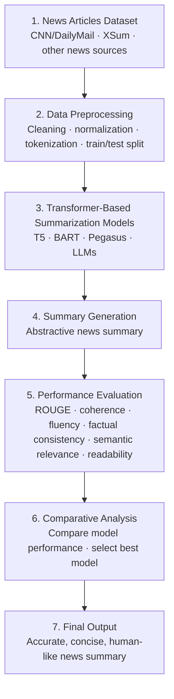

# 📰 Automatic News Summarization Using Large Language Models

[](https://www.python.org/)
[](https://pytorch.org/)
[](https://huggingface.co/docs/transformers)

A comparative study of transformer models and large language models for generating concise, coherent, and informative news summaries.

## 🎓 Course information

| Field | Value |
|---|---|
| Group | TEAM-3 |
| Course | APPLIED MACHINE LEARNING FOR TEXT ANALYSIS |
| Section | S4 |

## 👥 Team members

| S.No. | Roll No. | Student Name |
|---:|---|---|
| 1 | 2420030187 | G. Venkata Varun |
| 2 | 2420030111 | Srikar Jonnalagadda |
| 3 | 2420030228 | K. Pranav |

## 📝 Abstract

The growth of online news has made it harder for readers to identify relevant information quickly. This project compares T5, BART, Pegasus, and a large language model for abstractive news summarization using the CNN/DailyMail and XSum datasets. It assesses summary quality with ROUGE-1, ROUGE-2, and ROUGE-L, alongside qualitative review of coherence, fluency, factual consistency, semantic relevance, and readability. The study examines model quality, computational efficiency, and performance across different news domains, with the goal of identifying approaches that produce accurate, human-like summaries and improve access to news information.

## 🎯 Objectives

- Compare T5, BART, Pegasus, and a large language model on news summarization.
- Evaluate generated summaries quantitatively with ROUGE and qualitatively across the criteria listed in the project abstract.
- Analyze quality, computational efficiency, and generalization across the CNN/DailyMail and XSum datasets.
- Build an application for generating, comparing, and evaluating summaries.

## 📚 Datasets

| Name | Description | Link |
|---|---|---|
| CNN/DailyMail | News articles paired with multi-sentence reference summaries. | [Kaggle: Newspaper Text Summarization CNN/DailyMail](https://www.kaggle.com/datasets/gowrishankarp/newspaper-text-summarization-cnn-dailymail) |
| XSum (Extreme Summarization) | News documents paired with highly abstractive, typically single-sentence summaries. | [Hugging Face: EdinburghNLP/xsum](https://huggingface.co/datasets/EdinburghNLP/xsum) |

The project code loads CNN/DailyMail (`cnn_dailymail`, config `3.0.0`) and XSum (`xsum`) from Hugging Face `datasets` for experiments. The dataset URLs above are reproduced from the project abstract PDF.

## 🔄 Approach / pipeline

The flowchart follows the seven numbered stages in the project abstract diagram.



In the implementation, article text is cleaned and measured, then passed to selected models. Long local-model inputs are split at sentence boundaries and summarized in chunks. When reference text is provided, the application computes ROUGE; users can also submit qualitative ratings. Dataset experiments export result JSON and CSV files under `outputs/experiments/`.

## 🤖 Models compared

| Model | Description | Checkpoint / service in code |
|---|---|---|
| T5 | Text-to-Text Transfer Transformer; the T5 implementation prefixes input with `summarize:`. | `t5-small` |
| BART | Bidirectional and Auto-Regressive Transformer; uses a distilled summarization checkpoint. | `sshleifer/distilbart-cnn-12-6` |
| Pegasus | Transformer summarization model fine-tuned on XSum. | `google/pegasus-xsum` |
| LLM | Large language model accessed through the Groq API. | Configured by `GROQ_MODEL` (code default: `llama3-70b-8192`) |

Local checkpoints are downloaded on first use. The model manager loads them lazily and limits how many are kept in memory with `MAX_LOADED_MODELS`.

## 📏 Evaluation metrics

| Metric | Description |
|---|---|
| ROUGE-1 | Unigram overlap F1 against a reference summary. |
| ROUGE-2 | Bigram overlap F1 against a reference summary. |
| ROUGE-L | Longest common subsequence F1 against a reference summary. |
| Coherence | Qualitative assessment of logical flow and structure. |
| Fluency | Qualitative assessment of natural, grammatical language. |
| Factual consistency | Qualitative assessment of whether the summary is faithful to the article. |
| Semantic relevance | Qualitative assessment of whether key information is retained. |
| Readability | Qualitative assessment of clarity and ease of reading. |

The code calculates ROUGE with `rouge-score` and stemming when a reference is supplied. Human qualities are captured as optional 1–5 ratings through the interface; they are not automatically computed by the backend. In the UI/API, fluency is covered by the readability rubric rather than stored as its own rating.

## 📊 Results

No experiment output files were present in `outputs/experiments/` when this README was prepared. Metrics below remain **TBD** until measured result files are available.

| Model | Dataset | ROUGE-1 | ROUGE-2 | ROUGE-L |
|---|---|---:|---:|---:|
| T5 | CNN/DailyMail | TBD | TBD | TBD |
| T5 | XSum | TBD | TBD | TBD |
| BART | CNN/DailyMail | TBD | TBD | TBD |
| BART | XSum | TBD | TBD | TBD |
| Pegasus | CNN/DailyMail | TBD | TBD | TBD |
| Pegasus | XSum | TBD | TBD | TBD |
| LLM | CNN/DailyMail | TBD | TBD | TBD |
| LLM | XSum | TBD | TBD | TBD |

## 🗂️ Project structure

```text
.
├── backend/
│   ├── api/routes.py
│   ├── config/settings.py
│   ├── schemas/models.py
│   ├── services/
│   │   ├── evaluation.py
│   │   ├── experiment.py
│   │   ├── model_manager.py
│   │   ├── preprocessing.py
│   │   └── summarizers.py
│   ├── main.py
│   ├── Dockerfile
│   └── requirements.txt
├── docs/TEAM-3_Project_Abstract.pdf
├── frontend/
│   ├── src/app/                 # Next.js app and global styles
│   ├── src/components/          # Summarization, comparison, evaluation, experiment UI
│   ├── src/hooks/useSummarize.ts
│   ├── src/lib/                 # API client and shared TypeScript types
│   ├── package.json
│   └── Dockerfile
├── scripts/run_experiment.py
├── tests/                       # API, schema, preprocessing, evaluation, summarizer tests
├── .env.example
├── .gitignore
├── docker-compose.yml
├── pytest.ini
├── requirements.txt
├── test_api.py
└── README.md
```

The `data/` and `outputs/` directories are reserved for local data and generated results. Dataset files, CSVs, model checkpoints, environment files, Python caches, and frontend dependencies are excluded from Git.

## ⚙️ Installation and usage

### Prerequisites

- Python 3.10 or later
- Node.js and npm for the frontend
- Optional: a Groq API key for the LLM summarizer

### Set up the backend

From the repository root:

```bash
python -m venv .venv
# Windows PowerShell
.venv\Scripts\Activate.ps1
# macOS/Linux: source .venv/bin/activate
python -m pip install -r requirements.txt
```

The preprocessing module downloads NLTK's `punkt_tab` tokenizer data if it is missing. To enable the optional Groq model, make a local `.env` file and set `GROQ_API_KEY` to your own key:

```powershell
# Windows PowerShell
Copy-Item .env.example .env
```

```bash
# macOS/Linux
cp .env.example .env
```

Edit `.env` locally. Do not commit it.

### Run the application

Start the backend from the repository root (with the virtual environment activated):

```bash
uvicorn backend.main:app --reload --host 0.0.0.0 --port 8000
```

In a separate terminal, start the frontend:

```bash
cd frontend
npm install
npm run dev
```

The web app is at `http://localhost:3000`; FastAPI documentation is at `http://localhost:8000/docs`.

### Run a dataset experiment

From the repository root:

```bash
python scripts/run_experiment.py --dataset cnn_dailymail --num_samples 5
python scripts/run_experiment.py --dataset xsum --num_samples 10 --models t5 bart
```

Add `--include-llm` to include the Groq model; this requires `GROQ_API_KEY`. Results are saved under `outputs/experiments/`.

### Run with Docker Compose

With Docker installed, from the repository root:

```bash
docker compose up --build
```

## 🚀 Future work and conclusion

Potential next steps include preserving and reporting measured experiment results, adding a separate automated fluency evaluator, persisting human ratings, and expanding model and dataset coverage. The project proposes a comparative assessment of model quality, efficiency, and generalization; the included code provides article summarization, optional ROUGE and human evaluation, model comparison, and dataset experiment exports. No performance winner is claimed here because no experiment result files were present.

## 🙏 Acknowledgements

Acknowledgements were not specified in the project abstract PDF. Add contributors, tools, or institutional acknowledgements here if required by the course.
